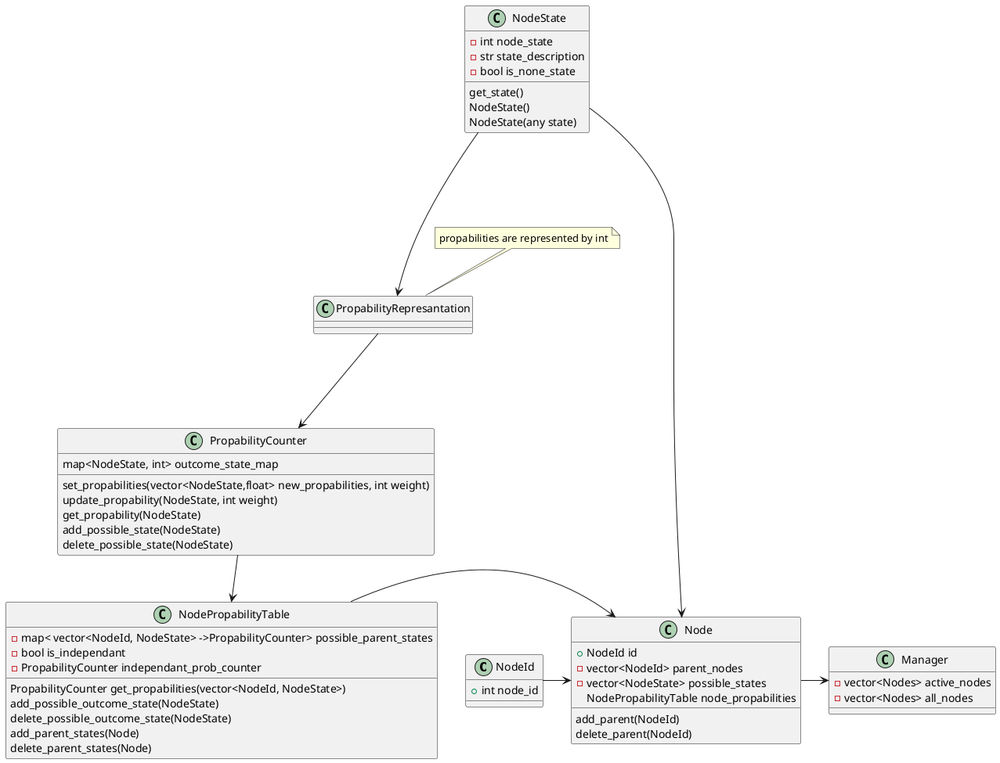

## Bayes network simulation plan.

```plantuml
@startuml
    
    class NodeId{
        + int node_id
    }

    class NodeState{
        -int node_state
        -str state_description
        -bool is_none_state
        get_state()
        NodeState()
        NodeState(any state)

    }


    
    class PropabilityCounter{
        map<NodeState, int> outcome_state_map
        set_propabilities(vector<NodeState,float> new_propabilities, int weight)
        update_propability(NodeState, int weight)
        get_propability(NodeState)
        add_possible_state(NodeState)
        delete_possible_state(NodeState)

    }

    class NodePropabilityTable{
        -map< vector<NodeId, NodeState> ->PropabilityCounter> possible_parent_states
        - bool is_independant
        - PropabilityCounter independant_prob_counter
        PropabilityCounter get_propabilities(vector<NodeId, NodeState>)
        add_possible_outcome_state(NodeState)
        delete_possible_outcome_state(NodeState)
        add_parent_states(Node)
        delete_parent_states(Node)

    }
    
    note "propabilities are represented by int" as n1
    
    
    n1 --> PropabilityRepresantation
    NodeState ----> PropabilityRepresantation
    PropabilityRepresantation ---> PropabilityCounter
    PropabilityCounter -->NodePropabilityTable
    

    class Node{
        + NodeId id
        - vector<NodeId> parent_nodes
        - vector<NodeState> possible_states
        NodePropabilityTable node_propabilities
        add_parent(NodeId)
        delete_parent(NodeId)


    }
    NodePropabilityTable -> Node
    NodeId -> Node
    NodeState -> Node

    class Manager{
        -vector<Nodes> active_nodes
        -vector<Nodes> all_nodes

    }

    Node -> Manager

@enduml
```

